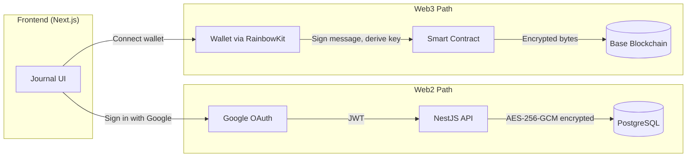
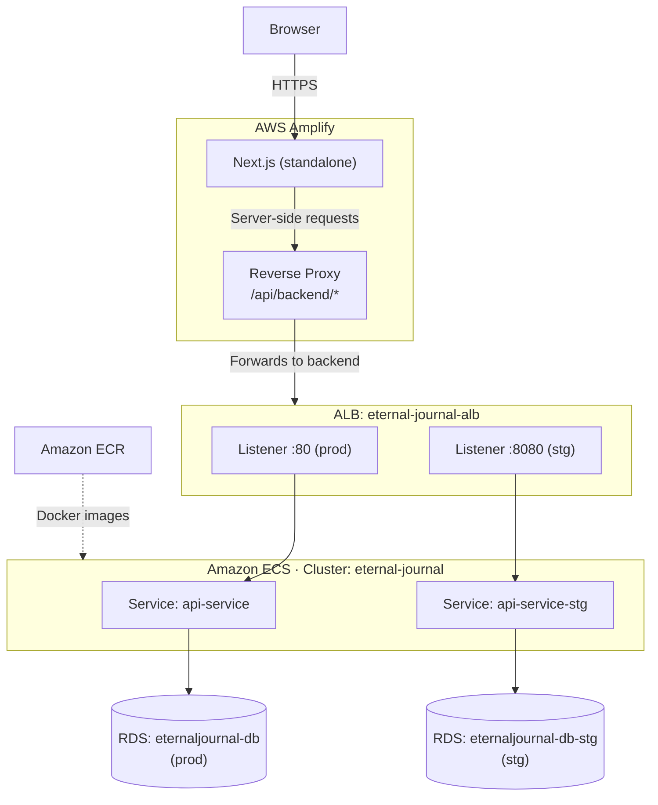

# Eternal Journal

A personal journaling app where every entry is encrypted and private. It works like any normal web app -- sign in with Google, write, done. But it also lets you save entries on the blockchain so they last forever, immutably, without depending on any server.

Web3 is an optional feature, not the main path. The app is fully functional as a traditional Web2 application. Blockchain integration exists for users who want permanent, immutable storage, but since connecting a wallet adds friction for the average user, it's simply an extra capability.

There are three ways to use it:

| Mode | Auth | Storage | Editable |
|------|------|---------|----------|
| **Guest** | None | Browser localStorage | Yes |
| **Web2** | Google OAuth | PostgreSQL (encrypted) | Yes |
| **Web3** | Wallet (RainbowKit) | Base blockchain (encrypted) | No (immutable) |

The app also has a community feature: users can share anonymous quotes from their journal entries, which go through admin moderation before appearing on the landing page.

## Web2 + Web3: how they coexist

Both paths live in the same UI. A user can use one, the other, or both at the same time. The frontend merges entries from all sources into a single unified view.

**Web2 path** -- Google OAuth produces a JWT. Entries are encrypted server-side with AES-256-GCM and stored in PostgreSQL via Prisma. Full CRUD: create, read, update, delete. Guest entries can be migrated to Web2 on sign-in.

**Web3 path** -- The user connects a wallet via RainbowKit. To derive an encryption key, the app asks the user to sign a deterministic message. That signature is hashed with SHA-256 to produce an AES-256 key. Entries are encrypted client-side with AES-256-GCM, encoded to raw bytes, and stored directly on-chain on Base (pure on-chain, no IPFS). These entries are immutable -- they cannot be edited or deleted.



## Tech Stack

Monorepo managed with Yarn workspaces:

```
eternal-journal/
├── apps/
│   ├── web/        # Next.js 14 · React 18 · Tailwind CSS · Framer Motion · Three.js · Wagmi / Viem / RainbowKit
│   └── api/        # NestJS 11 · Prisma 6 · PostgreSQL 16 · Passport (Google OAuth + JWT)
├── contracts/      # Solidity ^0.8.28 · Hardhat · OpenZeppelin (UUPS upgradeable)
└── docs/           # Architecture and setup documentation
```

### Smart Contract

The on-chain storage is handled by `EternalJournalPureOnChainV2.sol`, an upgradeable contract using the **UUPS proxy pattern** (OpenZeppelin). This allows fixing bugs or adding features without losing state or changing the contract address.

- **Encoding**: entries are encrypted client-side (AES-256-GCM) and encoded to **raw bytes** before being sent to the contract. The contract stores opaque byte arrays (max 1024 bytes per entry).
- **Multisig ownership**: the contract is owned by a **Safe multisig**, not an individual wallet. This protects against private key loss and requires multiple signatures for admin operations (upgrade, pause, withdraw fees, change fee amount).
- **Access control**: roles are separated (PAUSER_ROLE, UPGRADER_ROLE, FEE_MANAGER_ROLE) to limit what each signer can do.
- **Fee**: 0.00005 ETH per entry. Fees accumulate in the contract and are withdrawn through the multisig.
- **Network**: Base (Ethereum L2) -- Base Sepolia for testnet, Base mainnet for production.

## AWS Architecture

The backend runs on two isolated environments (staging and production) sharing a single ALB with port-based routing.



| | Staging | Production |
|---|---|---|
| **ECS Service** | `api-service-stg` | `api-service` |
| **Task Definition** | `eternal-journal-api-stg` | `eternal-journal-api-prod` |
| **ALB Port** | `:8080` | `:80` |
| **Target Group** | `eternal-journal-api-tg` | `eternal-journal-api-tg-prod` |
| **RDS Instance** | `eternaljournal-db-stg` | `eternaljournal-db` |

### Frontend -- AWS Amplify

The Next.js app is hosted on **AWS Amplify**, which builds it as a standalone output (configured in `amplify.yml`).

The frontend includes a **reverse proxy** route at `apps/web/src/app/api/backend/[...path]/route.ts`. All API requests from the browser go to `/api/backend/*`, which forwards them server-side from the Next.js API routes to the NestJS backend. The browser never talks directly to the backend URL. This keeps the backend origin private and allows controlled forwarding of headers and cookies. Routes are whitelisted -- only known endpoints are proxied.

### Backend -- Amazon ECS

The NestJS API runs as Docker containers on **Amazon ECS (Fargate)**, with a single **Application Load Balancer (ALB)** using port-based routing to separate staging (`:8080`) and production (`:80`). Docker images are stored in **Amazon ECR**.

Each environment has its own **Amazon RDS** instance running PostgreSQL 17, with independent data and credentials. Environment variables (including `DATABASE_URL`) are hardcoded in each ECS task definition.

### CI/CD -- GitHub Actions

The deployment pipeline (`.github/workflows/deploy.yml`) handles:

1. **Prisma migrations** -- runs automatically when the schema changes
2. **Docker build & push** -- builds API and Web images and pushes them to ECR
3. **Deploy to staging** -- automatic on every push
4. **Deploy to production** -- requires manual approval

## Local Development

### With Docker (recommended)

1. **Start PostgreSQL:**

```bash
docker run -d --name eternal-journal-db \
  -p 5432:5432 \
  -e POSTGRES_PASSWORD=postgres \
  -e POSTGRES_DB=eternal_journal \
  postgres:16
```

2. **Configure and migrate:**

```bash
cp apps/api/.env.example apps/api/.env
# Edit apps/api/.env with your Google OAuth credentials (GOOGLE_CLIENT_ID, GOOGLE_CLIENT_SECRET)

cd apps/api && npx prisma migrate dev --name init
cd ../..
```

3. **Install and run:**

```bash
yarn install
yarn dev
```

### Without Docker

```bash
yarn install
yarn dev
```

> Requires PostgreSQL running on `localhost:5432` with database `eternal_journal`. See [docs/DATABASE-SETUP.md](docs/DATABASE-SETUP.md).

---

- **Frontend**: http://localhost:3000
- **API**: http://localhost:3001

## Documentation

- [docs/PROJECT-OVERVIEW.md](docs/PROJECT-OVERVIEW.md) -- High-level architecture and data flow
- [docs/README-BLOCKCHAIN.md](docs/README-BLOCKCHAIN.md) -- Blockchain setup, encryption details, costs
- [docs/DATABASE-SETUP.md](docs/DATABASE-SETUP.md) -- PostgreSQL setup for dev, staging, and production
